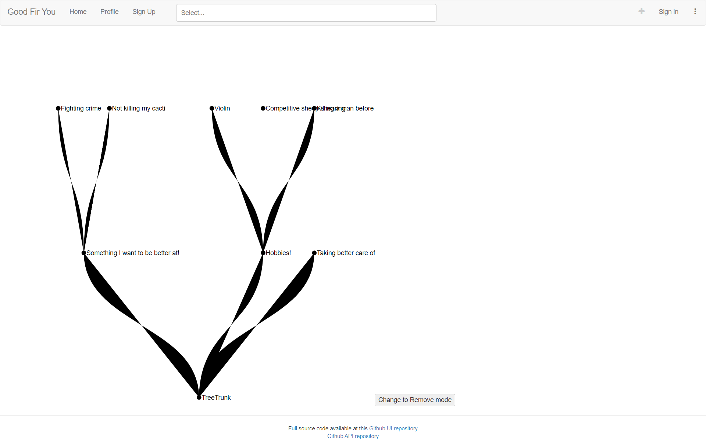
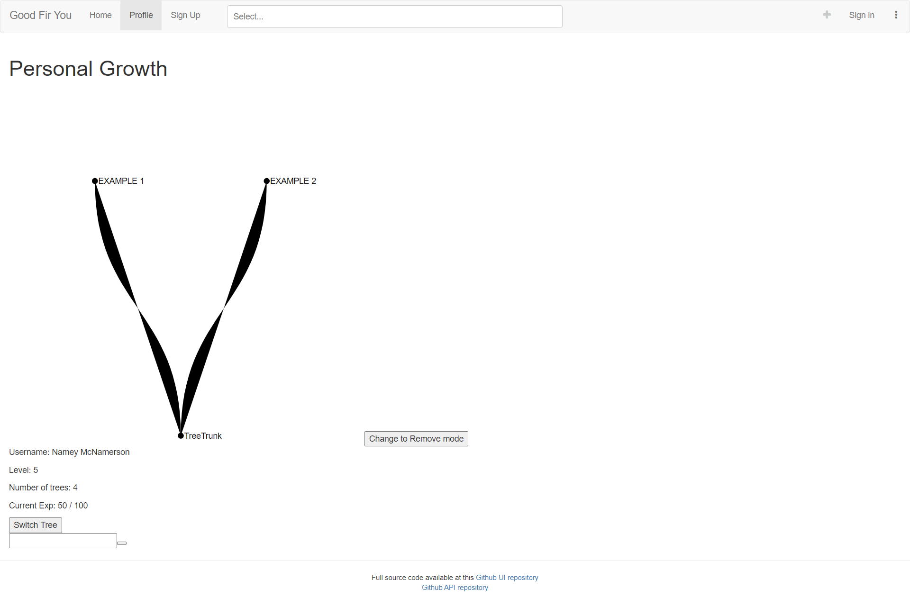

# GroupProject_GoodFirYou_UI

Group Members: Charlie Beiser, Steve Swanton, Joseph 'Dayton' Wilson

react-tree-graph is being used for creating a React-based tree
see: reactjsexample.com/a-react-library-for-generating-a-tree-graph-from-data-using-d3/

## Iteration 1

### Steve Swanton Contribution

Primary focus was on reworking API, see README: https://github.ccs.neu.edu/NEU-CS5610-SU20/GroupProject_GoodFirYou_API

- For UI implementation reworked book project routing to remove pages irrelevant to our project and replace them with required pages for goodFirYou.

- Put together a few placeholder components for routing purposes that were then built by teammates. See SignUp page and nearly all UI functionality implementation.

- Performed the initial setup of react-tree-graph library for our project and set up example pages on the Landing Page and the user profile. The trees' CSS will need to be changed for legibility and style needs, but my efforts to update the tree style was unsuccessful this iteration.

- Reworked the webpack.config in an attempt to be able to alter the react-tree module styling, but again was not successful

Screenshots of reworked navigation and the example trees:

### Charlie Beiser Contribution

-Created BranchMod class, which contains menu for adding, removing and editing individual nodes/branches. 

-Improved Enhancedtree class to enable compatability with BranchMod class. 

-Connected add and remove branch functionality of EnhancedTree class into to BranchMod menu. 
